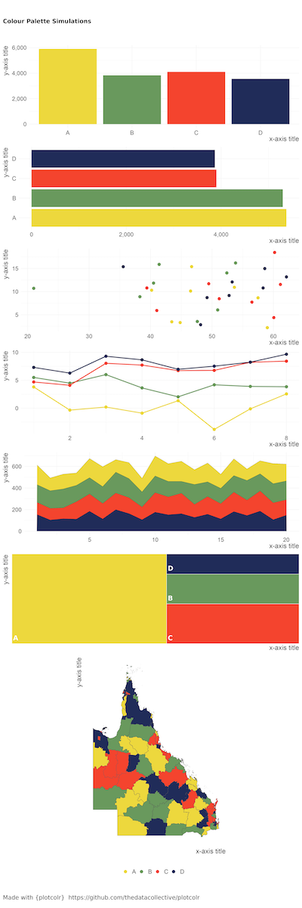
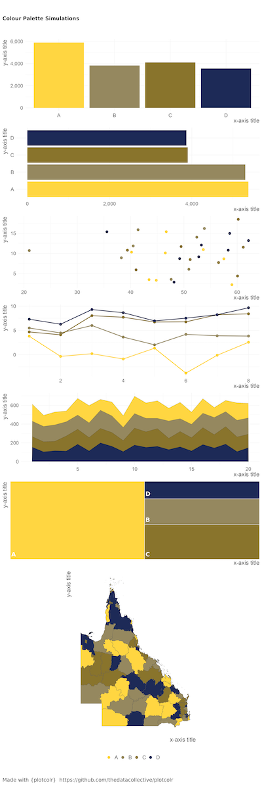

# plotcolr

<!-- badges: start -->
<!-- badges: end -->

The goal of `{plotcolr}` is to provide a straightforward way to be able to visualise a colour palette across a range of chart types.

`plot_palette()` does the main heavy lifting and will create a `ggplot2` object that can be rendered in interactive mode or saved to a file with `save_plots()`.

Why the name plotcolr? Well the concept is to simulate colours on a set of plots. But, as Australians, we spell colour with a 'u', while many others spell it without a 'u'. We thought it might be easier to omit the part that might make it challenging to remember how to spell the package name.

## Installation

You can install the development version of `{plotcolr}` from github with:

``` r
remotes::install_github("thedatacollective/plotcolr")
```

## Usage

The main function is `plot_palette()`.

```r
library(plotcolr)

# simulate the palette on a set of predefined charts
plot_palette(
  palette = c("#edd83d", "#69995d", "#f4442e", "#202c59")
)

# save the plots to a png file
save_plots("my_plotted_palette.png")
```



It can often be useful to see how a palette will look for different colour vision deficiencies.

```r
library(plotcolr)

# simulate the palette on a set of predefined charts
plot_palette(
  palette = c("#edd83d", "#69995d", "#f4442e", "#202c59"),
  cvd = "deutan"
)
```



```r
# visualise the most common colour vision deficiencies
# along with the palette
plot_palette(
  palette = c("#edd83d", "#69995d", "#f4442e", "#202c59"),
  cvd = "all"
)
```


We also wanted to make it easy to make see how a generated palette would look using the [coolors](https://coolors.co) service. `plot_coolors()` takes a url from the coolors website and simulates the colours on some plots.


```r
plot_coolors(
  url = "https://coolors.co/d7d9b1-84acce-827191-7d1d3f-512500"
)
```


Finally, we know that it can be helpful to see the palette as a document with the Hex, RGB and HSL colours together so we've created the `print_palette(), `show_palette()` and `save_palette()` functions to be able to see the colours as a specific set.

```r
print_coolors(
  url = "https://coolors.co/d7d9b1-84acce-827191-7d1d3f-512500"
)
```


---

Free software by:


